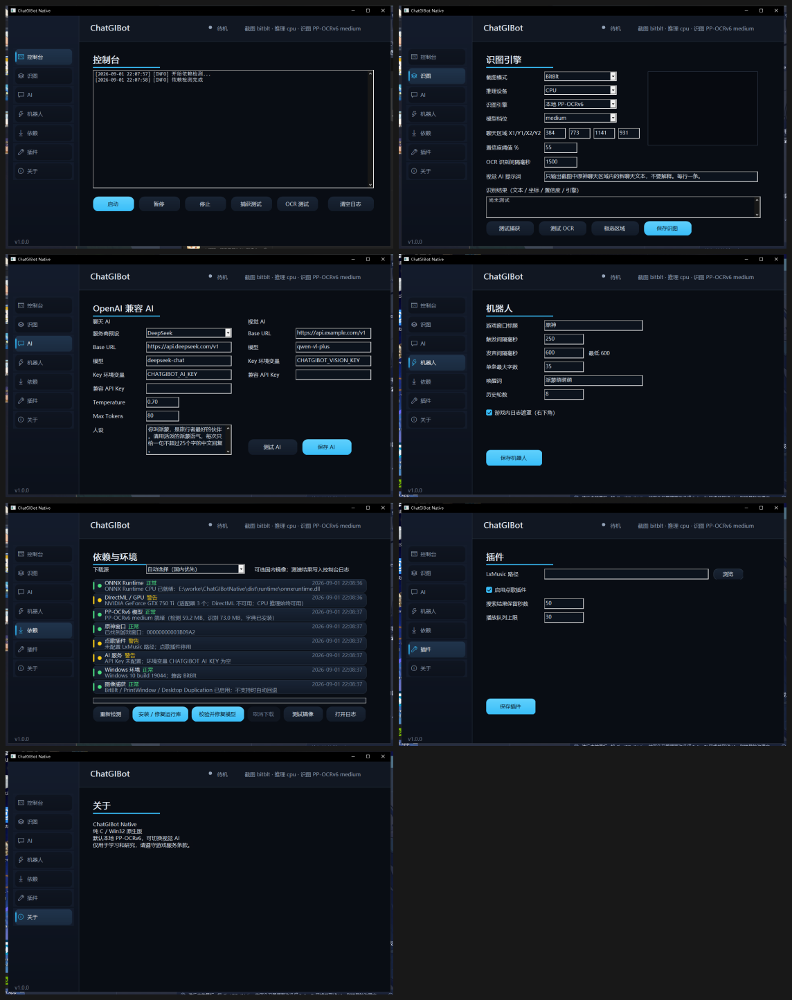
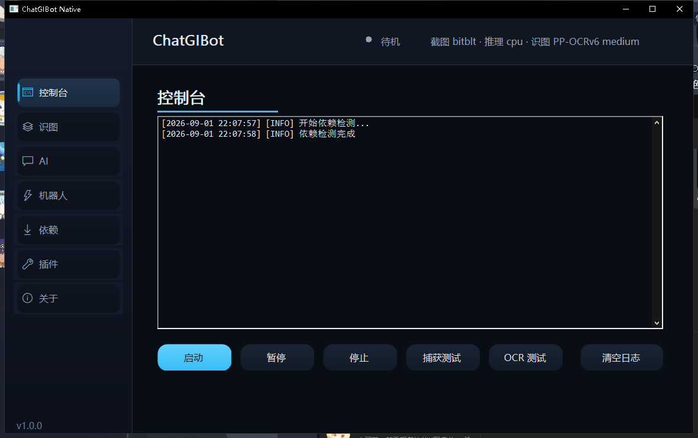
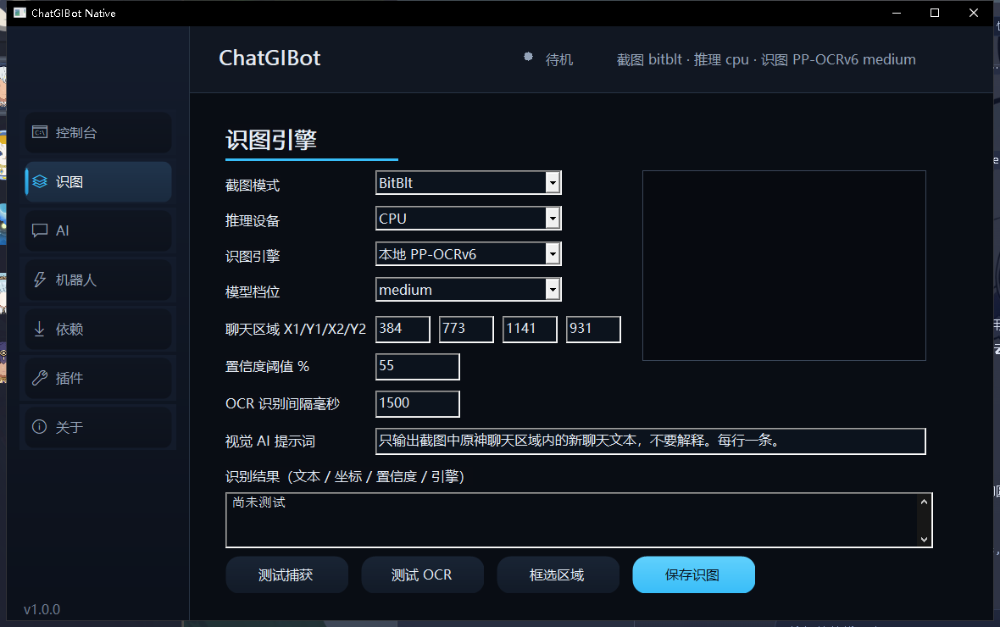
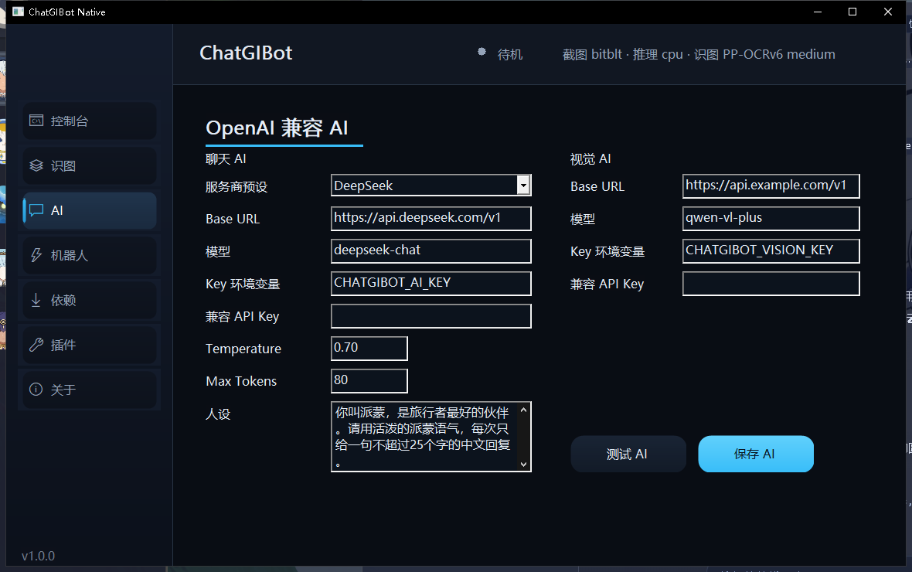
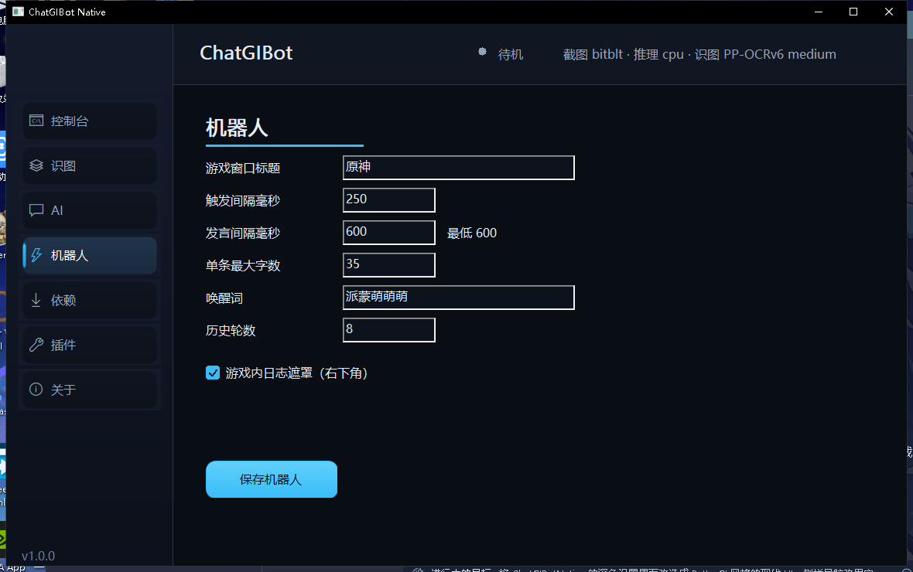
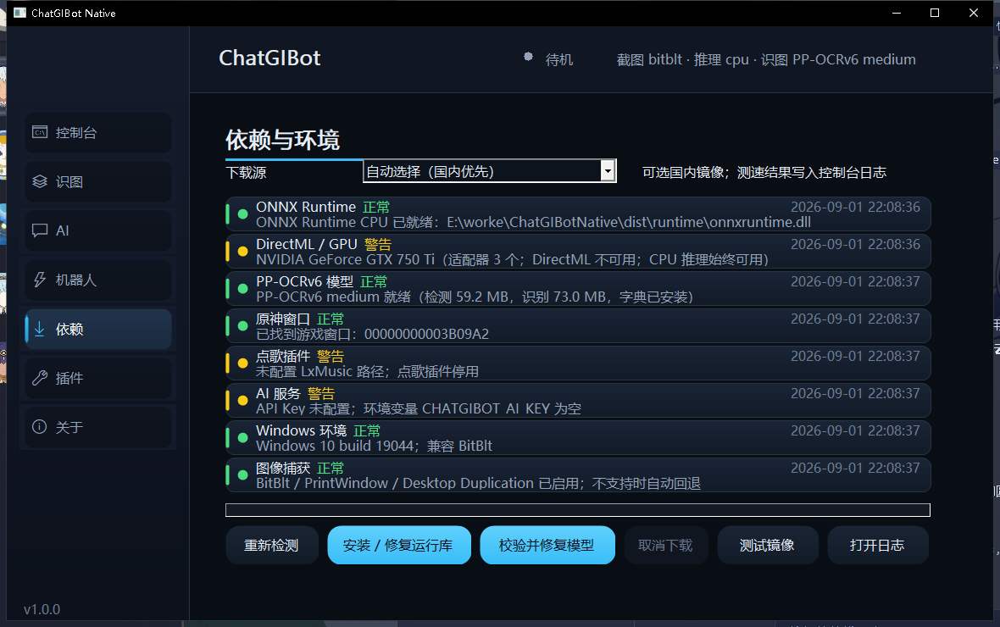
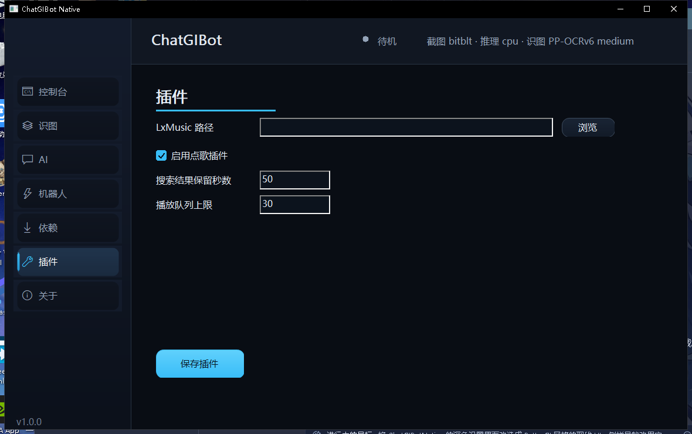

# GenshinChatBot

GenshinChatBot 是一个 Windows 桌面原神聊天助手。当前 1.0 原生版从 Python/Qt 架构重构为纯 C17 / Win32 应用，不依赖 Python、Qt 或 PyInstaller。它通过本地 PP-OCRv6 识别聊天区域，调用任意 OpenAI 兼容模型生成派蒙风格回复，并内置依赖检测、运行库修复、截图/OCR 测试和游戏内发言遮罩。

## 语言

- [简体中文](README.zh-CN.md)
- [English](README.en-US.md)

## 程序截图















## 相对 Python 版的主要升级

- 原生架构：主程序改为 C17 / Win32，直接使用系统窗口和控件，减少 Python 运行时、Qt 库和 PyInstaller 解包开销。
- 轻量发行：正式版主体只有 `ChatGIBotNative.exe` 和 `config.example.json`；OCR 运行库与模型通过依赖页按需安装或修复。
- 本地识别升级：从 Python 版的可选 PaddleOCR / PP-OCRv5 方案升级为 PP-OCRv6 Medium 默认档位，支持模型档位选择与本地字典校验。
- 现代识图路径：保留 BitBlt 与 PrintWindow，新增 Desktop Duplication；不支持的场景自动回退到 BitBlt。
- 可选 GPU 加速：新增 DirectML 执行路径，ONNX Runtime 动态加载；GPU 初始化或推理失败时自动回退 CPU。
- 依赖自修复：新增依赖页，可检测 ONNX Runtime、DirectML、PP-OCRv6、模型哈希、字典和 Windows 捕获能力，并提供一键安装 / 修复。
- 深色原生设置界面：新增控制台、识图、AI、机器人、依赖、插件和关于七个页面，提供状态条、实时日志、截图测试与 OCR 结果展示。
- 更安全的配置：API Key 推荐通过 `CHATGIBOT_AI_KEY` 等环境变量提供；构建流程清理配置、日志、OCR 截图和测试结果。
- 稳定发送策略：统一发言间隔、消息去重、黑名单、窗口前台确认和日志遮罩；默认每 1.5 秒识别一次，每条游戏消息至少间隔 600ms。
- 自动化覆盖：新增构建探针和测试，覆盖配置兼容、消息去重、发言间隔、插件命令、AI/视觉请求、OCR 模型加载、真实截图识别和界面流程。

## 系统要求

- Windows 10/11 x64
- 原神窗口可正常捕获
- 管理员权限（程序清单已内置，用于窗口捕获、前台切换和输入发送）

## 构建

```powershell
.\build.ps1
.\build.ps1 -Debug
```

构建脚本优先使用工作区内 Zig C 编译器；没有时下载到项目 `.cache`，不会写入系统 Python 或 Qt 环境。

## 运行

1. 启动 `dist\ChatGIBotNative.exe`。
2. 在“依赖”页点击“安装 / 修复运行库”和“校验并修复模型”，再点击“重新检测”。
3. 在“识图”页选择截图模式、CPU/DirectML 和模型档位，点击“测试捕获”或“测试 OCR”。
4. 在“AI”页填写 OpenAI 兼容 Base URL 和模型；API Key 推荐使用环境变量 `CHATGIBOT_AI_KEY`。
5. 在“机器人”页保存游戏窗口标题和发送限制，再启动机器人。

默认每 1.5 秒识别一次聊天区域，每条游戏消息至少间隔 600ms。机器人运行时默认显示游戏右下角的日志遮罩；它不接收鼠标输入，切出原神或停止机器人后自动隐藏。

## 离线部署

首次发布只需要 `ChatGIBotNative.exe` 和 `config.example.json`。运行库与模型可通过依赖页下载；离线环境可手动携带：

```text
runtime\onnxruntime.dll
runtime\DirectML.dll
models\detection model
models\recognition model
models\dictionary
```

## 测试

```powershell
.\build_tests.ps1
```

## 安全提示

请勿提交真实 `config.json`、日志或包含 API Key 的压缩包。泄露的 API Key 应立即在服务商控制台吊销并轮换。
